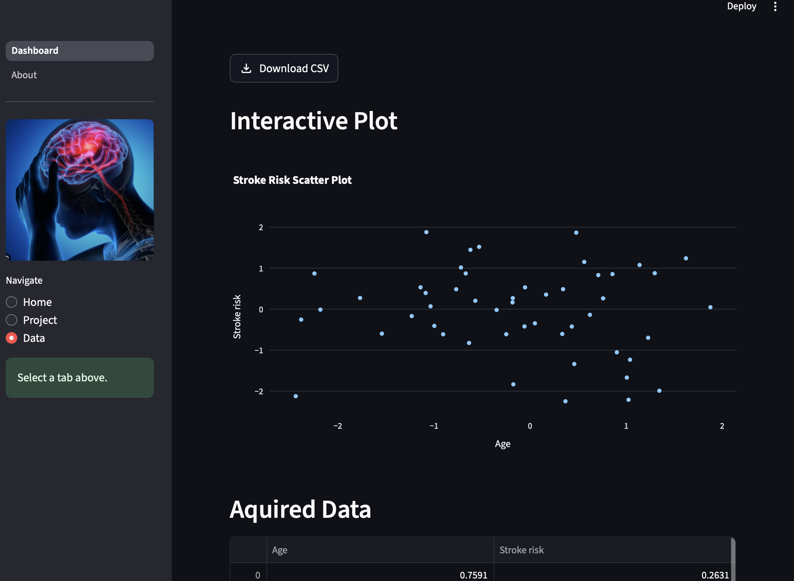
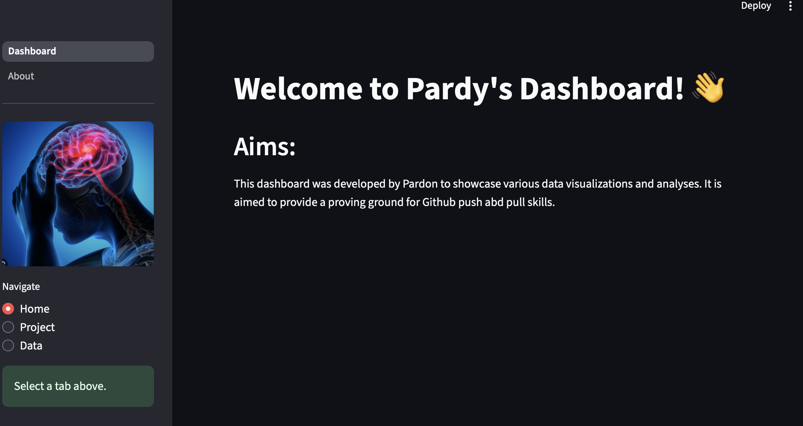

# PROHI Dashboard Example

**Author**: [Pardon Runesu]
<!-- As main author, do not write anything in the line below.
The collaborator will edit the line below in GitHub -->
**Collaborator**:Zipei Yang


## Introduction

_This template project will contain a simple interactive web dashboard with Streamlit. It has a sidebar and the mainpage. The main interactions are within the sidebar. 
_





## System description
_The project has two main Tabs, the Dashboard and the About section.
The Dashboard has three navigation buttons; Home, Project and Data
1. Home: This section displays the aims of the project, which in this case are just to showcase the push and pull skills in github.
2. Project: This section displays what the project is about amd where the dataset is from.
3. Data: This section displays the actual dataset in use and displays the results

### Installation of libraries

Run the commands below in a terminal to configure the project and install the package dependencies for the first time.

If you are using Mac, you may need to install Xcode. Check the official Streamlit documentation [here](https://docs.streamlit.io/get-started/installation/command-line#prerequisites).

1. Create the environment with `python -m venv env`
2. Activate the virtual environment for Python
   - [Linux/Mac] `source env/bin/activate` 
   - [Windows command prompt] `.\env\Scripts\activate.bat` 
   - [in Windows PowerShell] `.\env\Scripts\Activate.ps1`
3. Make sure that your terminal is in the environment (`env`) not in the global Python installation. The terminal should start with the word `env`
4. Install required packages ` install -r pip./requirements.txt`
5. Check that the installation works running `streamlit hello`
6. Stop the terminal by pressing **Ctrl+C**

### Execute custom Dashboard

First, make sure that you are running Python from the environment. Check the steps 2 and 3 above. Then, to run the custom dashboard execute the following command:

```
> streamlit run Dashboard.py
# If the command above fails, use:
> python -m streamlit run Dashboard.py
```

### Dependencies

Tested on Python 3.12.7 with the following packages:
  - Jupyter v1.1.1
  - Streamlit v1.46.1
  - Seaborn v0.13.2
  - Plotly v6.2.0
  - Scikit-Learn v1.7.0
  - shap v0.48.0

## Contributors

_Pardon Runesu: pardonm6@gmail.com, 0764278764
